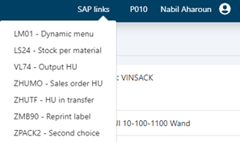
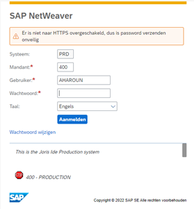

# SAP Links & Resources

This section explains how to access the MES application for the first time and how to correctly complete the initial login process.

---

If necessary, it is possible to consult a number of SAP transactions from the MES Application. For this purpose a button is provided in the main bar in the MES Application. After clicking on **'SAP Links'**, you will see which SAP transactions are accessible from MES. When you click on one of these transactions, a new tab will be opened which will redirect you to SAP NetWeaver. Here you enter your SAP user ID and password and click on **'Log on'**. After a successful login, you will be redirected to the transaction you have indicated in the MES application.

<!-- Images side by side using Markdown table trick -->
  &nbsp;&nbsp;&nbsp;&nbsp; 
