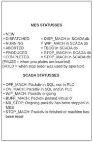
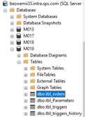

# SCADA Flow Overview

This chapter explains the communication between MES and SCADA and how the various statuses are recorded within the production process.

---

## START FLOW

1. **Next Pack Division is sent to machine:**
   a. **Normal flow:**
   - MES status: Dispatched  
   - SCADA status: DISP_MACH  
   
   b. **(Optional) HP plates are sent:**
   - Status: Pause  
   - Status back to DISP_MACH after complete production of HP plates  
   
   c. **(Optional) Operator clicks on Stop Order:**
   - Status: HOLD  
   - MES: Order is returned to Order Processing  

2. **Production is started by operator (_Cut_Pieces >= 1):**
   - MES status: Running  
   - SCADA status: WIP_MACH  

3. **(Optional) Operator forwards HP plates or clicks on Stop Order while order is still running:**  
   a. **HP plates forwarded:**
   - Status: Pause  
   - Status back to WIP_MACH after complete production of HP plates  

   b. **Operator clicks on Stop Order:**
   - MES status: Produced (remaining plates will be returned to order preparation)  
   - SCADA status: STOP_MACH  

4. **All records have been produced (_PIECES_CUT = PIECES_WANTED):**
   - MES Status: Produced  
   - SCADA status: STOP_MACH  

5. **Next PACK Division is sent to machine**

6. **Operator confirms number of sheets produced**
   - MES status: Completed  

The relevant table (`tbl_orders`) for the SCADA statuses can be found in SQL by following the path at the work centre as shown in the screenshot below. On the next page you will find a flow chart to visualise the status flow.

