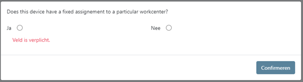
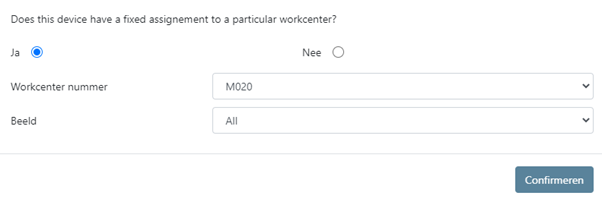

# Sign Up / Access Request

This section explains how to access the MES application for the first time and how to correctly complete the initial login process.

---

## Accessing the MES Application

You can start the MES application using the following link:

🔗 **MES Application URL**  
- PRD: https://bezwemii33.intra.sps.com/ji-mes/#/login
- QAS: https://mesqas.joriside.be/

The MES login screen will open in your browser.

---

## Logging In
Use SSO (Single Sign on), or:
1. Enter your **MES user name**
2. Enter your **MES password**
3. Click **Login**

After successful authentication, the MES homepage will load.

---

## First-Time Login: Workcenter Assignment

When logging in for the **first time**, a pop-up window will appear asking whether the device is connected to a specific **Workcenter**.

### Choose the correct option:

- **Yes**  
  Select this option **only if** the device is physically connected to a specific Workcenter.

- **No**  
  Select this option if:
  - You are using a shared or mobile device
  - You are not assigned to a fixed Workcenter
  - You are unsure

After selecting **No**, confirm the message to continue.

> ⚠️ **Important:**  
> Connecting a device to a Workcenter can **only** be performed by a **Supervisor or Administrator**.

---

## Selecting a Workcenter (Yes Option)

If you selected **Yes**, you must complete the following steps:

1. Select the **correct Workcenter**
2. Select the appropriate **View**
3. Confirm your selection

Once confirmed, the device will be linked to the selected Workcenter and the MES interface will load accordingly.

---

## Notes & Recommendations

- If you selected the wrong option, contact a **Supervisor or Admin**
- Do **not** assign a Workcenter unless the device is permanently installed
- Workcenter assignments affect available functions and data visibility

---

If you need access changes or encounter login issues, contact your local MES administrator.
