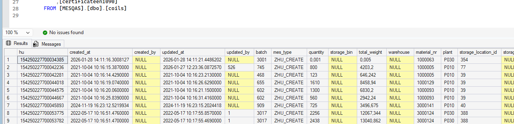
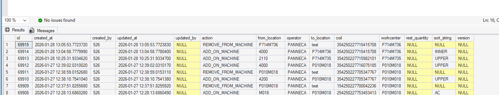

# [DevOps - 11198 - put pack on location in MES](https://dev.azure.com/kingspan-com/Joris%20Ide%20MES/_workitems/edit/11198)

---

TO DO: changed WC => failed

for the coils we have the 'coils' table that stores all the coils with their WH location

Each time a coild is added or removed from the machine, this is logged:

export const PrintButton = () => (
  <button 
    onClick={() => window.print()}
    className="button button--primary"
    style={{
      marginBottom: '1rem',
      display: 'inline-flex',
      alignItems: 'center',
      gap: '8px'
    }}>
    🖨️ Pagina exporteren naar PDF
  </button>
);

<PrintButton />