# [13908 - max PACK weight niet toepassen op PILES proposal](https://dev.azure.com/kingspan-com/Joris%20Ide%20MES/_workitems/edit/13908)

---

=> link met 17647 & 17649??

17647: no weight from sap = no message
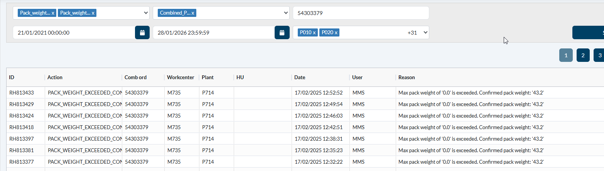

17649: round all 3 decimals => also 22742
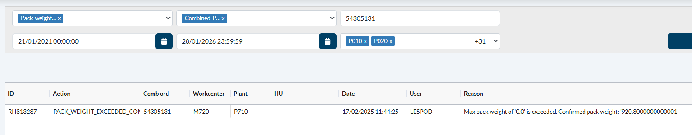

<h1>1.	Using the control keys:</h1>
In de routing heb je de control keys:
 
 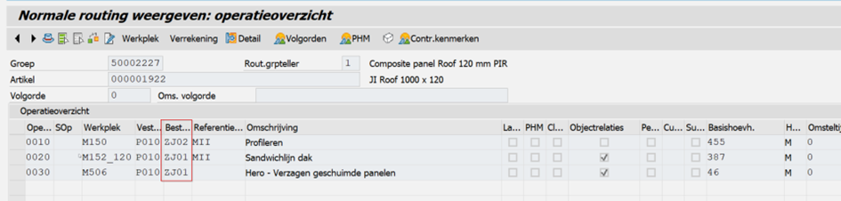

Explanation:
 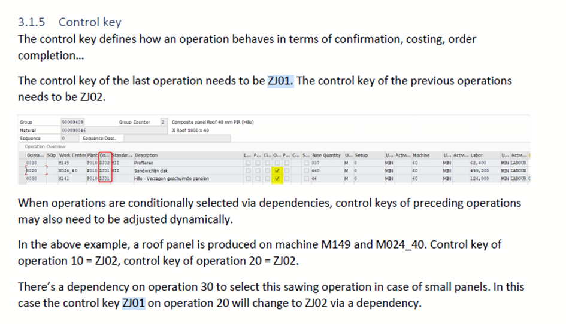
ZJ01 (PLPO-STEUS) is de laatste stap in het productieproces 
Combined order: 54365808
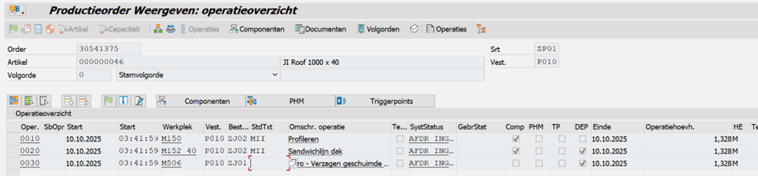	
 
Routing with its operations of the PO show ZJ01 at oper 30 (last step)

SQL:
 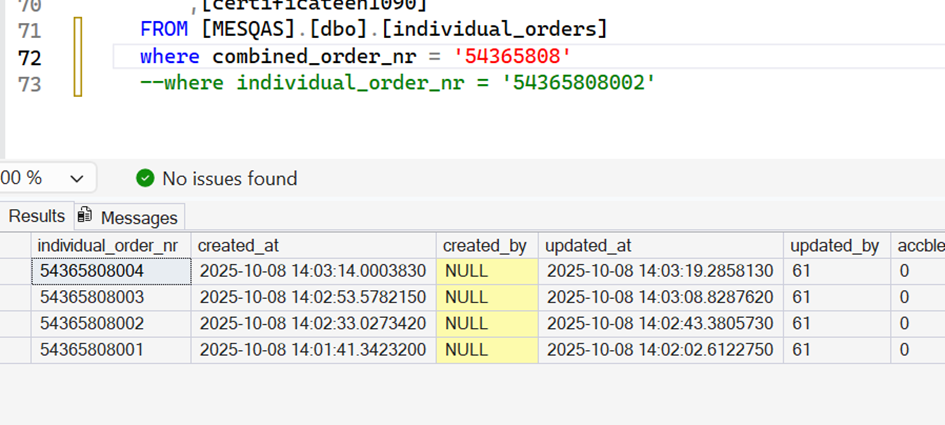
 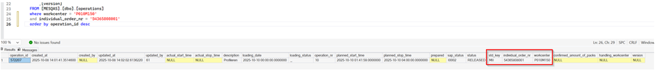
 
In the operations table we could add the control key of the order operations and only add the weight check on ‘ZJ01’ operations

Remark: last step of Mes is operation 20, however operation 30 also seems to get synced. So the solution is doable:
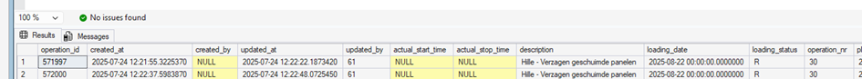
 

<h1>2.	Using the max_operation_nr</h1>
In the combined_orders table, there is the field max_operation_nr
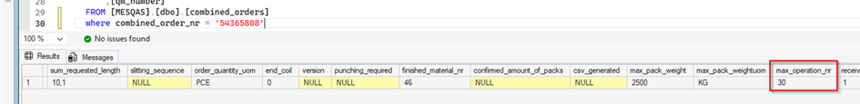
 
Using this field would require less setup as we don’t need to sync the control keys between SAP and MES first. 
=> always correct in the routing (no sawing is no operation 30)

<h1>3.	Via loading status</h1>
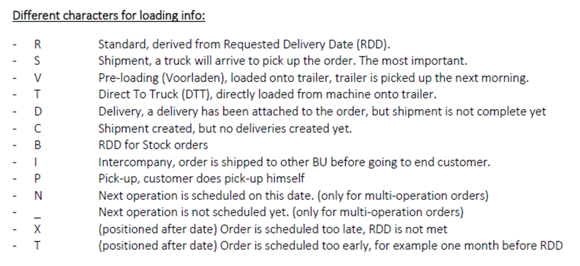	
The weight check can also be done only for a certain few loading statuses. To be decided for which loading statuses und in the operations table:
 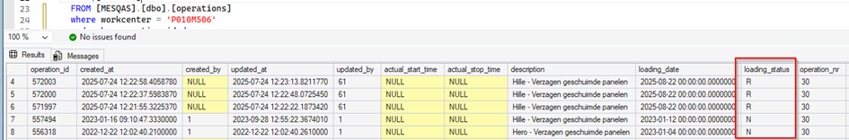

export const PrintButton = () => (
  <button 
    onClick={() => window.print()}
    className="button button--primary"
    style={{
      marginBottom: '1rem',
      display: 'inline-flex',
      alignItems: 'center',
      gap: '8px'
    }}>
    🖨️ Pagina exporteren naar PDF
  </button>
);

<PrintButton />