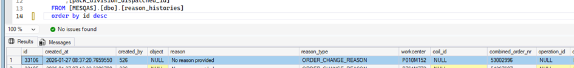
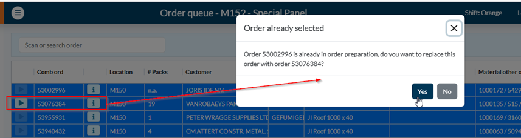
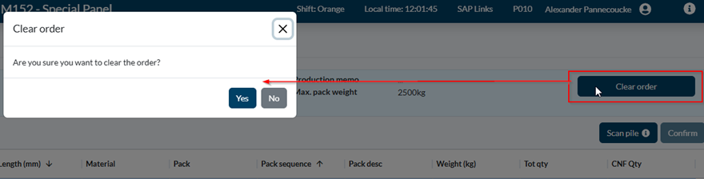
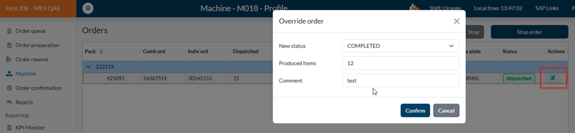
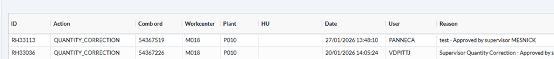
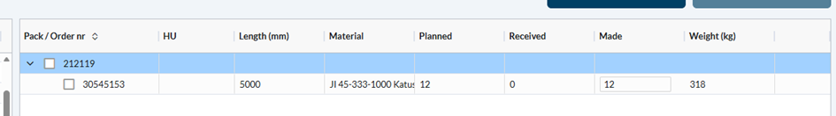

# [DevOps - 14698 - Business monitor expand action types](https://dev.azure.com/kingspan-com/Joris%20Ide%20MES/_workitems/edit/14698)

---

<h1>1. ORDER_CHANGE_REASON:</h1>
<h3>1.1.	ORDER_PCNF:</h3> 
when selecting an order in the QUEUE and putting it into order preparation, a line is added to the reason_histories
 
Proposal: 
already exists in message tracing, can be removed from business monitor

<h3>1.2.	ORDER_FIFO: see reason 33 => a reason can be added </h3>
=> order_fifo should be the only one remaining under the ORDER_CHANGE_REASON => so the name must be changed to ORDER_FIFO (to test: select not the next order but a bit further, a message will appear with pop-up)

<h3>1.3. </h3>
 => doesn't need to be logged anymore

<h3>1.4. </h3>
  => but shouldn't be logged in the business monitor

<h3>1.5. </h3>
  => but shouldn't be logged in the business monitor

<h1>2. Qty correction</h1>
 
 

In the confirmation screen, 12 pcs are created:
 

We should also log the actual quantity / status + the changed quantity / status.
=> 	Don’t we see the changed and original qty in the confirmation screen? Or add it to the reason text?

=> planned: 15pcs dispatched: 12pcs selected + status (completed, aborted,...)

export const PrintButton = () => (
  <button 
    onClick={() => window.print()}
    className="button button--primary"
    style={{
      marginBottom: '1rem',
      display: 'inline-flex',
      alignItems: 'center',
      gap: '8px'
    }}>
    🖨️ Pagina exporteren naar PDF
  </button>
);

<PrintButton />