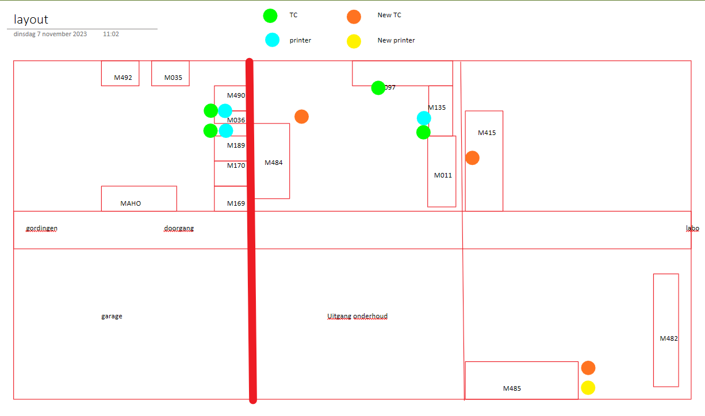

# [DevOps - 15982 - Rollout P010 Bending >1.5mm M097+M135+M011+M482+M484+M485+M415](https://dev.azure.com/kingspan-com/Joris%20Ide%20MES/_workitems/edit/15982)

---

TO DO: go live

bendingafdeling dik plooiwerk op MES.

OP10; vlak leggen coil (+ ponsgaten )
te bekijken hoe sap flow in elkaar zit, is geen SLITTING
virtueel met coil consumptie in confirmatiescherm 
conform P600M601

OP20: (plooien)
virtuele zonder consumptie (backflush sap)
zoals MPL1 met mes virtueel wc M001-M002.. ifv beschikbare tc's
sap M482 = MES M482 (share tc met M485) + M484 
(of gewoon alles op M482 laten staan zonder child wc's indien je op meerdere tc's ander order in prep/conf kan zetten)
 
OP30 (lassen)
virtueel afmelden, enkel zpack zonder coil consumptie (backflush materialen)
zoals virtueel profiles/bending
conform P600M604

materials locations feature te voorzien tss OP10, OP20 & OP30 (te checken of rework correct werkt, nog nooit rework voor ander OP ingegeven, is split screen met voorgaande operatie)

Flow bending ( vet gedrukt = SAP WC)

 
| Operatie | Work Centers |
| :--- | :--- |
| OP10 | M097, M135 |
| OP20 | M011, M484, M485, M482 |
| OP30 | M415 |

in de toekomt kan M097 & M135 voorzien worden van XML file transfert om ponsdata info digitaal door te geven.
dit is een compleet andere inhoud dan bijv M041. complexer dan gordingen, je kan ook bijvoorbeeld in een cirkel ponsen met deze sturing

----

afsplitsen van material locations voor die WC's.

voorzien van nieuwe groep? en afsplitsen mat locaties per WC type/groep

----
te vergelijken met slit => bending => opzetten in QAS

- Losstaand: material location opsplitsen, nu op plant, moet op WC
- OP10: aanmaken als virtuaal slitting => te bekijken (enkel hier verbruik)
- OP20: aanmaken als bending
- OP30: aanmaken als bending

=> opzetten in QAS

export const PrintButton = () => (
  <button 
    onClick={() => window.print()}
    className="button button--primary"
    style={{
      marginBottom: '1rem',
      display: 'inline-flex',
      alignItems: 'center',
      gap: '8px'
    }}>
    🖨️ Pagina exporteren naar PDF
  </button>
);

<PrintButton />