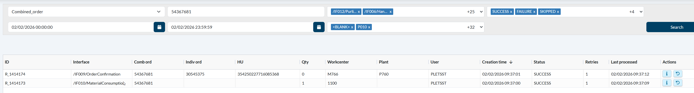
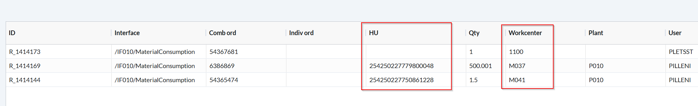

# [DevOps - 17534 - message tracing: Workcenter 1105 ?](https://dev.azure.com/kingspan-com/Joris%20Ide%20MES/_workitems/edit/17534)

---

TO DO: Naam wijzigen naar storage location, query updaten om ook 1105 of 1100 te tonen

Query voorbeelden met storage locations te vinden:
SELECT TOP (1000) [id]
      ,[created_at]
      ,[created_by]
      ,[request_body]
      ,[request_url]
      ,[response_body]
      ,[pack_confirmed_id]
      ,[can_send_email]
      ,[interface_type]
      ,[last_response_code]
      ,[retries]
      ,[status]
  FROM [MESQAS].[dbo].[rfcs_log]
  where interface_type ='/IF010/MaterialConsumption' and (request_body LIKE '%storageLocation":"1100%' or request_body LIKE '%storageLocation":"1105%')

  SELECT TOP (1000) [id]
      ,[created_at]
      ,[created_by]
      ,[request_body]
      ,[request_url]
      ,[response_body]
      ,[pack_confirmed_id]
      ,[can_send_email]
      ,[interface_type]
      ,[last_response_code]
      ,[retries]
      ,[status]
  FROM [MESQAS].[dbo].[rfcs_log]
  where interface_type ='/IF009/OrderConfirmation' and pack_confirmed_id = '134891'

  => in QAS 1 voorbeeld (comb order: 54367681)

=> zoeken op combined order geeft beide lijnen, zoeken op workcenter 1100 of 1105 geeft niets

 1. in de Message Tracing: wijzig de omschrijving van de kolom 'Workcenter' naar 'Storage Location' of 'Stor. Loc.', idem voor het selectieveld in de dropdown

 2. bij het zoeken op storage location 1100 or 1105 moeten de lijnen ook zichtbaar zijn

 3. voor de lijnen met MaterialConsumption, moet daar geen Plant en HU staan?

=> bernard wil dit niet doen, moet in S4 worden opgezocht

export const PrintButton = () => (
  <button 
    onClick={() => window.print()}
    className="button button--primary"
    style={{
      marginBottom: '1rem',
      display: 'inline-flex',
      alignItems: 'center',
      gap: '8px'
    }}>
    🖨️ Pagina exporteren naar PDF
  </button>
);

<PrintButton />