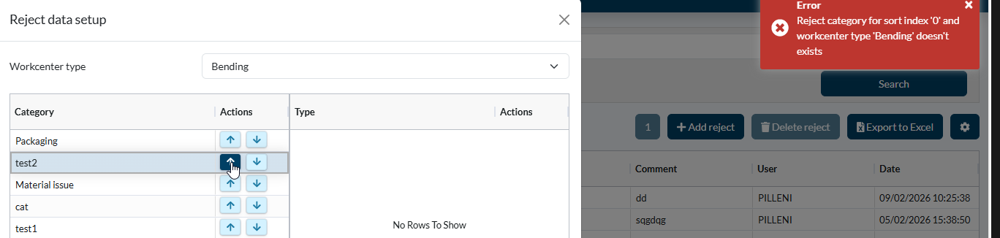
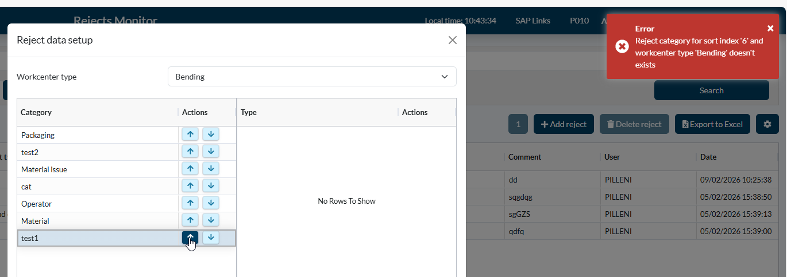
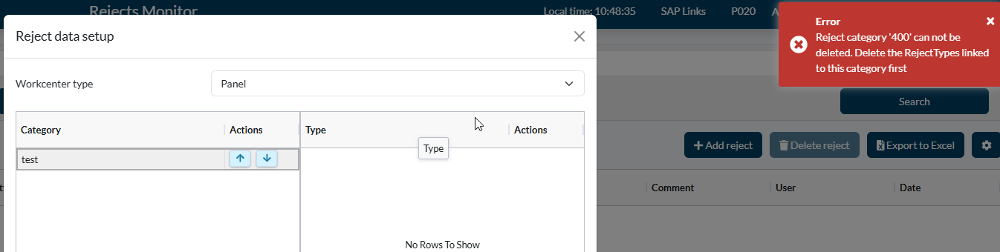
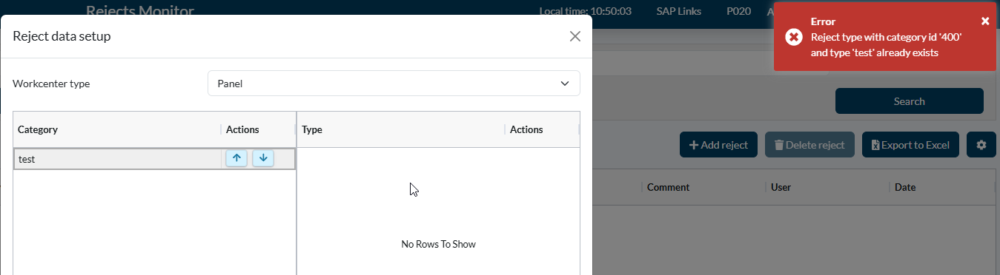

# [DevOps - REJECTS: kan geen categorie wissen als type leeg is](https://dev.azure.com/kingspan-com/Joris%20Ide%20MES/_workitems/edit/20335)

---

TO DO: Rejects monitor => settings => issue with categories

1. test case: P010 in QAS => Bending
2 rejects aangemaakt voor de Bending P010 in QAS (test1 & test2). 

=> test2 kan niet naar boven worden geduwd omdat er geen index nummer aan gekoppeld is.

2. P020 QAS => panel

3. P020 QAS => panel
=> er was een type 'test' gekoppeld. Nadien verwijdert, wanneer ik deze terug wil toevoegen krijg ik:

=> puntje 2 & 3, kan het zijn dat het type in de achtergrond niet correct verwijdert wordt waardoor de category zelf niet kan verwijdert worden?

export const PrintButton = () => (
  <button 
    onClick={() => window.print()}
    className="button button--primary"
    style={{
      marginBottom: '1rem',
      display: 'inline-flex',
      alignItems: 'center',
      gap: '8px'
    }}>
    🖨️ Pagina exporteren naar PDF
  </button>
);

<PrintButton />