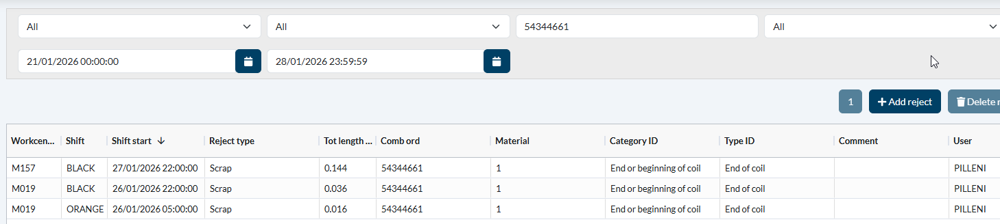

# [DevOps - 20454 - REJECTS MONITOR: add searchfield Combined Order](https://dev.azure.com/kingspan-com/Joris%20Ide%20MES/_workitems/edit/20454)

---

TO DO: combined order has to be added in the search function

leaving combined order field empty shows all records. adding a value filters out.

export const PrintButton = () => (
  <button 
    onClick={() => window.print()}
    className="button button--primary"
    style={{
      marginBottom: '1rem',
      display: 'inline-flex',
      alignItems: 'center',
      gap: '8px'
    }}>
    🖨️ Pagina exporteren naar PDF
  </button>
);

<PrintButton />