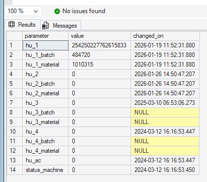
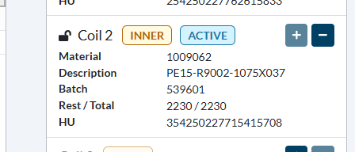
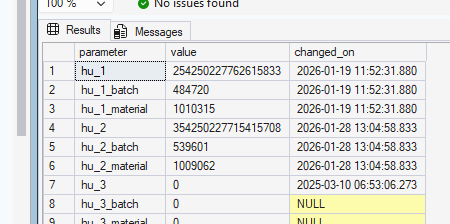

# [DevOps - 21495 - BALEX MMS add batch of scanned HU to tbl_parameters](https://dev.azure.com/kingspan-com/Joris%20Ide%20MES/_workitems/edit/21495)

---

TO DO: check if the batch and matnr is available for newly scanned orders at P714M736

Defaut state:

Adding the Coil2:

DB is updated:

=> when removing, table is emptied again

export const PrintButton = () => (
  <button 
    onClick={() => window.print()}
    className="button button--primary"
    style={{
      marginBottom: '1rem',
      display: 'inline-flex',
      alignItems: 'center',
      gap: '8px'
    }}>
    🖨️ Pagina exporteren naar PDF
  </button>
);

<PrintButton />