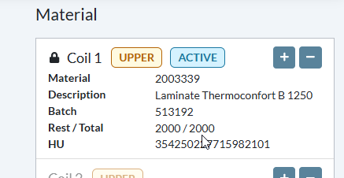

# [DevOps - 21814 - material type check => include material group (P7x cannot scan laminate on coilpos)](https://dev.azure.com/kingspan-com/Joris%20Ide%20MES/_workitems/edit/21814)

---

TO DO: or P714 it must be possibe to scan an AC HU (ZROH) as UPPER on the machine (M735)

1. in LS24 search for matnr 002003339 in P714, now copy a HU and search it in HUMO. Block and unblock it, it will be sent to MES (use message tracing to check HU_CREATE)

2. go to M735 in MES => machine screen. enter the HU number, MES accepts it:

export const PrintButton = () => (
  <button 
    onClick={() => window.print()}
    className="button button--primary"
    style={{
      marginBottom: '1rem',
      display: 'inline-flex',
      alignItems: 'center',
      gap: '8px'
    }}>
    🖨️ Pagina exporteren naar PDF
  </button>
);

<PrintButton />
