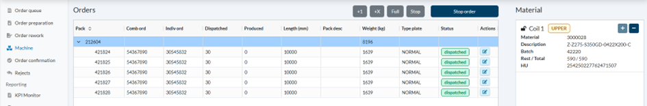
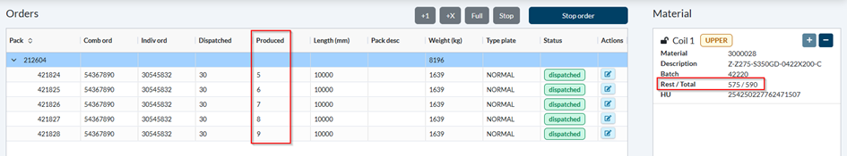
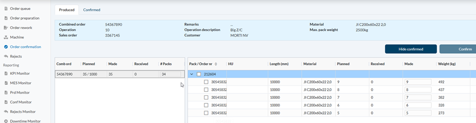
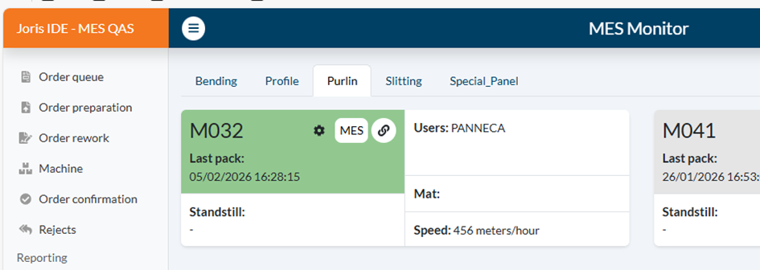
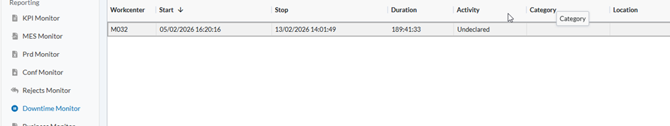

# [DevOps - 23095 - Set up test case in QAS for M032](https://dev.azure.com/kingspan-com/Joris%20Ide%20MES/_workitems/edit/23095)

---

SO: 3367145 => comb order: 54367890 => PO: 30545832
Dispatch:

Updating table changes the coil used and produced qty:

Confirmation screen

----
Downtimes
Status 0 => 1:
Machine komt groen

=> Machine stond op 0 en de flow kon volledig doorlopen worden, als de machine niet draait, zou je dan orders moeten kunnen ingeven?

export const PrintButton = () => (
  <button 
    onClick={() => window.print()}
    className="button button--primary"
    style={{
      marginBottom: '1rem',
      display: 'inline-flex',
      alignItems: 'center',
      gap: '8px'
    }}>
    🖨️ Pagina exporteren naar PDF
  </button>
);

<PrintButton />