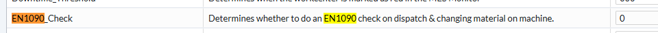
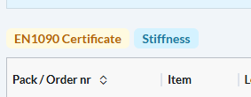
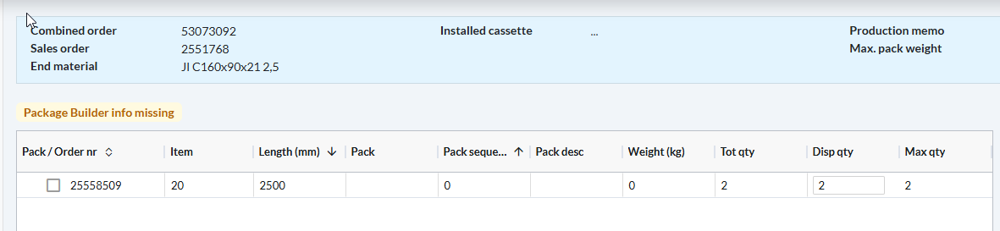

# [DevOps - 23698 - EN1090 label altijd tonen, ongeacht actieve check of niet](https://dev.azure.com/kingspan-com/Joris%20Ide%20MES/_workitems/edit/23698)

---

TO DO: EN1090 zou moeten zichtbaar zijn indien de vlag aan staat, ook als de EN1090 check niet actief staat op het work center

workcenter config:

<h2>Profiling:</h2>
in the order preparation, the EN1090 certificate message is showing when the config status is 0 and 1

<h2>Purlin:</h2>
No EN1090 is visible

=> can be caused by broken orders, check op PRD after P2P

=> no EN1090 on slitting

export const PrintButton = () => (
  <button 
    onClick={() => window.print()}
    className="button button--primary"
    style={{
      marginBottom: '1rem',
      display: 'inline-flex',
      alignItems: 'center',
      gap: '8px'
    }}>
    🖨️ Pagina exporteren naar PDF
  </button>
);

<PrintButton />