# UAIS - Unified Access & Identity Strategy

---

## 4 gedefinieerde problemen met user management:
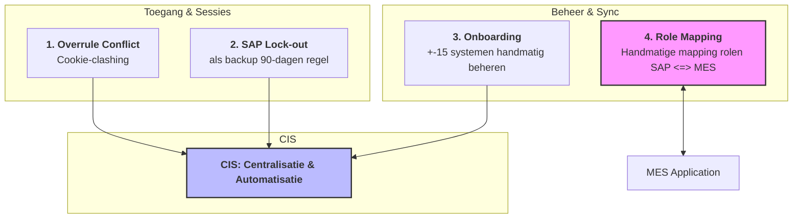

---

## problem 1: MES Overrule
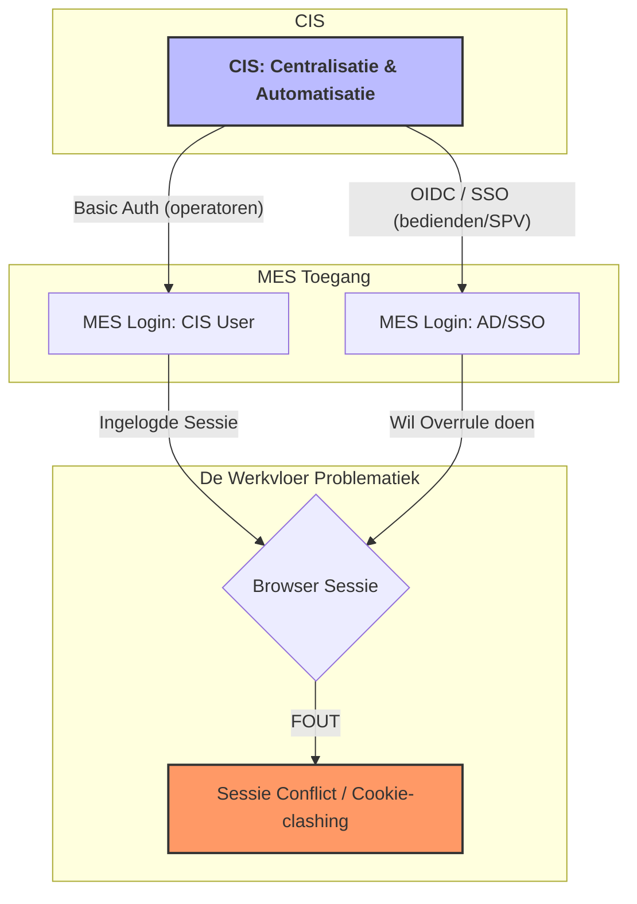
### User management:
-	SAP: iedereen heeft een SAP user
-	MES: operator gebruiker hun CIS user om in te loggen, Supervisors/key-users gebruiken SSO/AD-user
-	Logingegevens CIS zijn anders dan SAP (vroeger SAP credentials, nu niet meer), operator krijgen een user vanuit CIS
-	CIS: Middleware, verbindt AD/SSO met MES, bepaalt wie mag inloggen in het MES en met welke rechten
    => 	OIDC (OpenID Connect) voor de MES login, en SAML voor sap entera (SSO)

### Problematiek:
Het CIS wordt aangevuld adhv 2 verschillende bronnen (AD/SSO en CIS zelf). MES haalt dan de gebruikers op via CIS. Wanneer de supervisor een overrule moet doen kan de browser kan de Supervisor (OIDC/SSO) niet authenticeren zonder de sessie van de Operator (Basic Auth) te breken (cookie-clashing). CIS op zich is niet het probleem, maar eerder hoe de browser omgaat met de cookies van 2 verschillende users. 

#### Doel:
-	Toegang: Operatoren (SAP CIS) en Supervisors (AD/SSO) probleemloos naast elkaar werken in het MES.
#### Voorstel:
-	##### Creatie van micro-service met microsoft authenticator waarbij supervisor QR code scant vanop het scherm en zo de overrule accepteert: te bespr met Dennis

Onderscheid SSO en CIS in DB (te verifieren):
 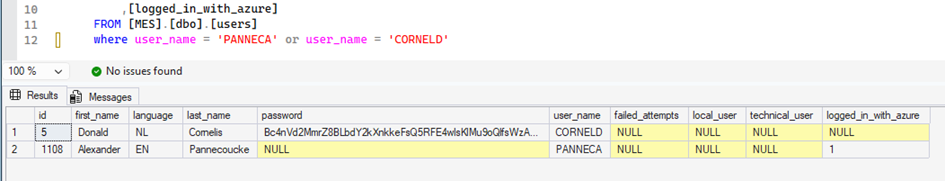

 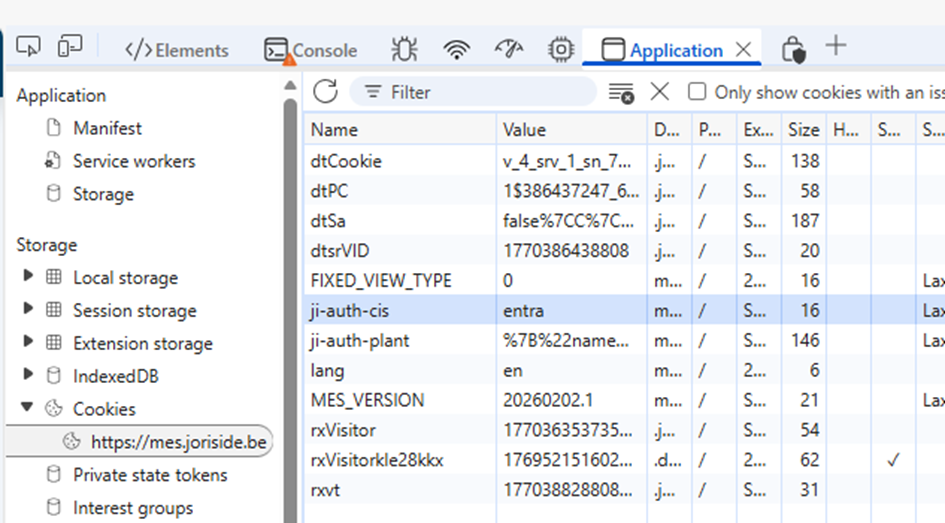
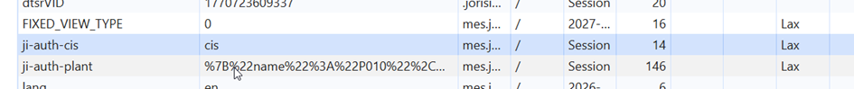

(Enkel in JI hebben operatoren geen AD, in Balex wel)
- Algemeen probleem, zowel bij SSO als CIS, alles gaat over CIS. 8 of 9 opties bekeken voor het overrule probleem (met CIS), maar geen oplossing. CIS laat slechts 1 login toe, als supervisor inlogt op thin client voor overrule, wordt hij op andere plaatsen uitgelogd. Bijkomend probleem: soms gaat de user verderwerken onder de supervisor user waardoor hij dan plots teveel rechten heeft => audit issue
- Arno: ‘probleem valt niet op te lossen’. SSO slechts 1 sessie tegelijk, in CIS nemen ze de sessie van de operator over. 
- Enkel in Zwevezele hebben supervisors een smartphone (andreas heeft gezegd dat supervisors overal smartphone gaan krijgen tegen eind 2026)

---

## problem 2: SAP lock out
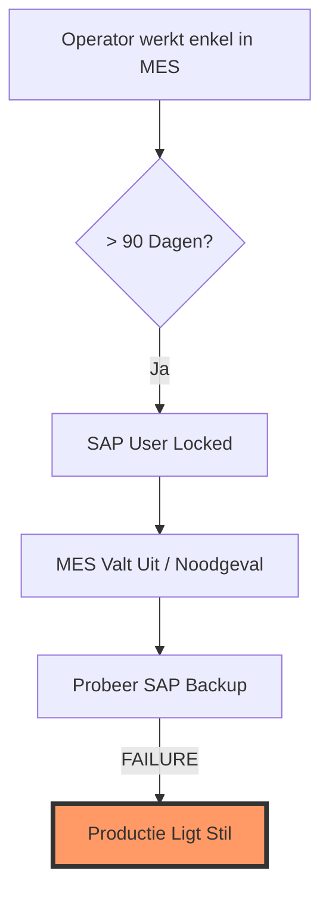
Operatoren gebruiken hoofdzakelijk MES en hebben SAP als backup. Echter als MES lange tijd draait en de operator logt 90 dagen niet in in SAP wordt hij gelocked. SAP als backup heeft dan nog weinig zin als operatoren bij uitval niet kunnen inloggen.
- Voor MES wordt via Fiori mogelijkheid voorzien om paswoorden te resetten. Opgezet om snel te kunnen resetten door supervisors. Als CIS wordt gebruikt om de SAP users met MES te linken om zo met hun SAP gebruiker in te loggen ipv CIS user, zou de blokkade zo vermeden kunnen worden. (Mes login = last login date)

---

## probleem 3: onboarding
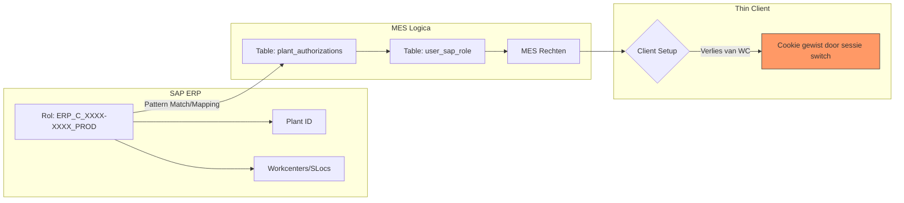
- Nele zet taken op en HR gebruikt die om personeelsnr aan te maken (taak: maak sap gebruiker aan of referentiegebruiker, mail to, …) => komt dan naar Florian. Altijd een HR taak voor het aanmaken van een gebruiker.
- Maandelijks audit => wie heeft AD gebruiker en SAP gebruiker? User mag in principe niet gekopieerd worden
- Werkt vrij goed maaar auditlijst klopt niet altijd => bvb: fiori gebruiker aangemaakt voor mensen uit dienst => nagaan bij jelle als ergens een mass create gebeurd is. 

=> 	Zie PA20:
- systemen: MES - SAP prd - FIORI (CIS) -	BI - Solman - MII - AD - RF setting - Email - Sap dev (200 & 220) -	Sap qas - Sbx (sandbox sap) - Fiori non-prd - Datasphere

#### Problematiek:
-	User management is heel tijdrovend (+-15 verschillende systemen) => mogelijkheid tot centralizeren?
-	Soms onduidelijkheid bij nieuwe gebruikers, komt vooral voor wanneer men afwijkt van de normale procedure.

#### Doel:
-	Het realiseren van een betrouwbaar, gestandaardiseerd proces. 
-	Beheer: De werklast voor IT en HR vermindert door automatische rol-synchronisatie.
-	Identiteiten: gestandardiseerde flow voor aanmaken en beheren 

#### Voorstel: 
- ##### CIS als centralisatie => DENNIS/JELLE. Kan CIS ook accounts aanmaken in andere systemen?

---

## probleem 4: User roles sync 
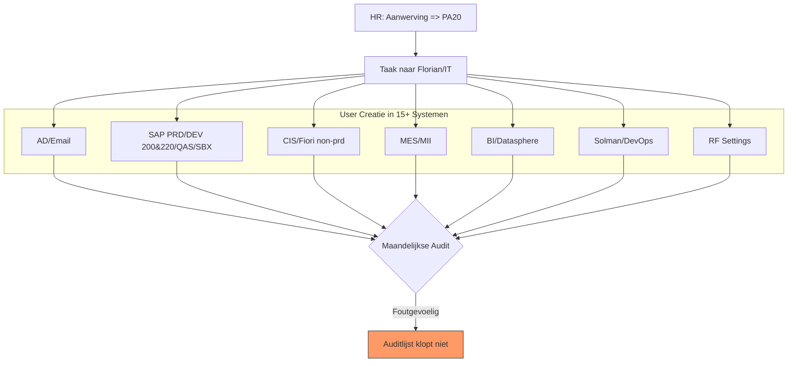
ERP_C_XXXX-XXXX_PROD_SHFT_SPRV
- De XXXX-XXXX is voor een algemene user. Rechten worden verder gedefinieerd per groep, plant. Daaronder worden de rollen verder onderverdeeld in workcenters & storage locations.
- In MES is er een mapping die de SAP rollen naar de rollen van MES connecteert. 
- Bij het aanmaken van een gebruiker in MES worden zijn rechten toegekend. Wanneer een user voor de eerste keer aanmeld zullen zijn rechten worden opgehaald vanuit SAP en in de front-end verwerkt.
- Soms heeft een werkcenter verschillende schermen op datzelfde werkcenter (bvb ansbach, verschillende stappen op zelfde machine)
- Een user heeft toegang tot alle machines van een plant maar heeft geen MES monitor om te switchen (bepaald op thin clients niveau). Bij het opstarten van MES op een nieuwe machine zal gevraagd worden om de juist machine in te stellen op de client. Als de user daarna inlogt zal het systeem nagaan als de ingestelde machine bestaat in de plant van de rechten toegekend aan de ingelogde user. Bij een match zal het juiste werkcenter meteen worden weergegeven aan de user.
Iedere rol heeft subrollen:
 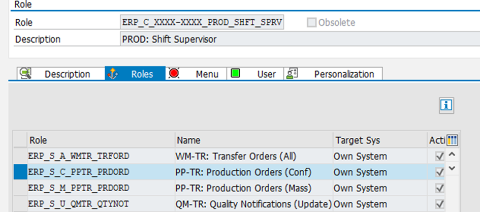
Onder deze subrollen zijn de storage locations, werkcenters en plants gekoppeld:
 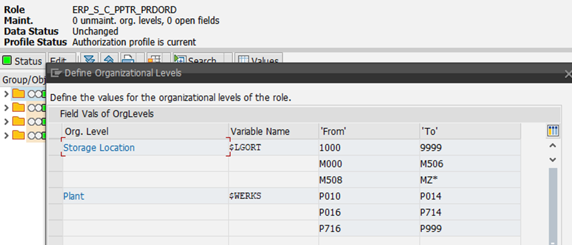

#### Problematiek:
-	Wanneer een nieuwe plant wordt opgestart of nieuwe rollen moeten aangemaakt worden is er heel wat opzetwerk nodig voor de mapping te kunnen doen met kans op fouten. 
-	Operator heeft toegang tot alle machines en de machine is ingesteld op de clients => probleem met cookies dat het ingesteld WC soms gewist wordt

#### Voorstel 
-	De rechten/rollen zitten reeds in SAP, deze zouden gesynced kunnen worden met MES. In MES is het niet nodig om dan apart rollen aan te maken. 
-	XXXX ingevuld met plant, zo weet MES welke rollen.
-	Tabel plants_authorizations => link tussen plant en user sap rol
-	Table user sap role => elke rol is gelinkt aan interne rol in mes
-	Combinatie van de 2 laat toe de link te vinden
 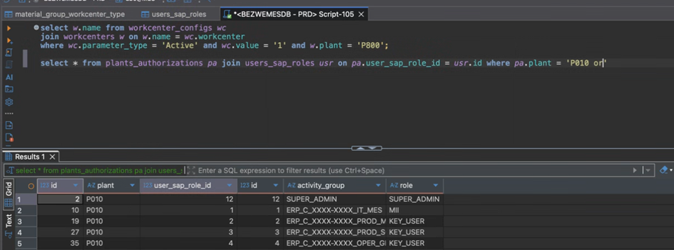

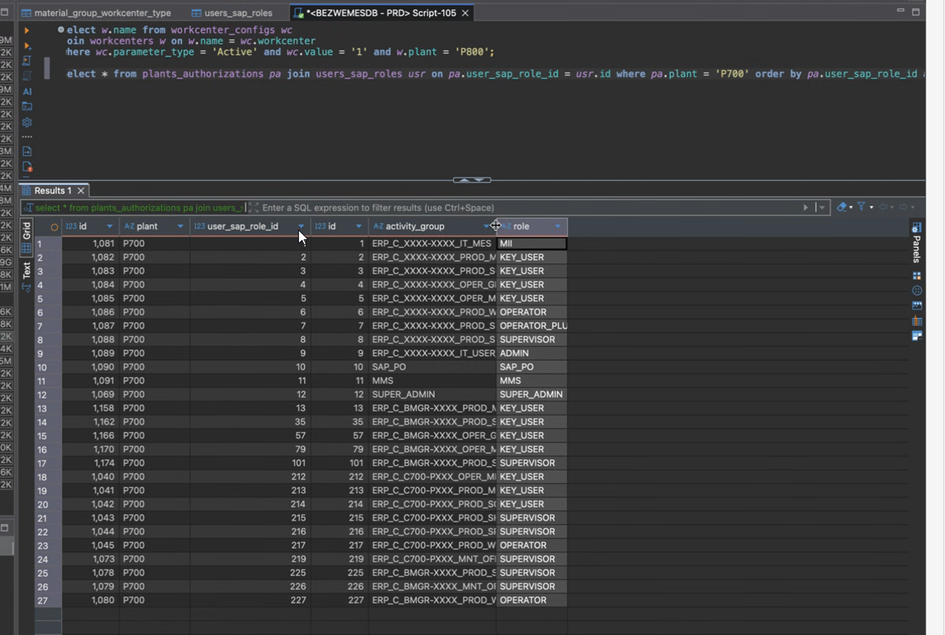
 
#### Pro: 
-	Kans op fouten verminderd (single source of truth)
-	Bij wijziging in SAP worden rechten in MES ook gewijzigd, dan kan dit niet meer vergeten worden
-	Bij opzet nieuwe rechten, minimale manuele aanpassing (minder manueel werk)
-	Beter overzicht
-	Security: als iemand uit dienst gaat vervalt de MES toegang => goed voor audit

#### Cons:
-	Wat opzetwerk en herziening
-	Sync/interface issues
##### Nick: oplijsten: hoe vaak gebeuren hier fouten of vergetelijkheden? 

export const PrintButton = () => (
  <button 
    onClick={() => window.print()}
    className="button button--primary"
    style={{
      marginBottom: '1rem',
      display: 'inline-flex',
      alignItems: 'center',
      gap: '8px'
    }}>
    🖨️ Pagina exporteren naar PDF
  </button>
);

<PrintButton />

