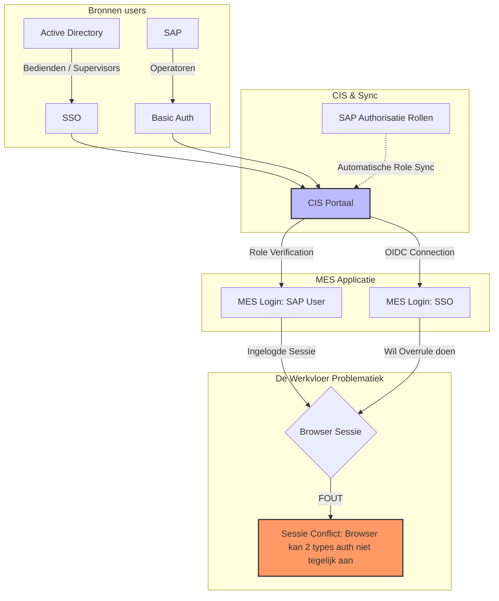

# Protput

```mermaid
graph TD

subgraph Bron_Systemen [Bronnen users]
    AD[Active Directory] -- "Bedienden / Supervisors" --> SSO
    SAP[SAP] -- "Operatoren" --> BASIC[Basic Auth]
end

subgraph Middleware [CIS & Sync]
    SSO --> CIS[CIS Portaal]
    BASIC --> CIS
    SAP_ROLES[SAP Authorisatie Rollen] -. "Automatische Role Sync" .-> CIS
end

subgraph Werkvloer [MES Applicatie]
    CIS -- "OIDC Connection" --> MES_SSO[MES Login: SSO]
    CIS -- "Role Verification" --> MES_BASIC[MES Login: SAP User]
end

subgraph Conflict_Zone [De Werkvloer Problematiek]
    MES_BASIC -- "Ingelogde Sessie" --> BROWSER{Browser Sessie}
    MES_SSO -- "Wil Overrule doen" --> BROWSER
    BROWSER -- "FOUT" --> FAIL[Sessie Conflict: Browser kan 2 types auth niet tegelijk aan]
end

style FAIL fill:#f96,stroke:#333,stroke-width:2px
style CIS fill:#bbf,stroke:#333,stroke-width:2px
```
    
