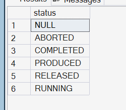

SELECT 
    op.*, 
    ord.*
FROM [MES].[dbo].[operations] AS op
INNER JOIN [MES].[dbo].[individual_orders] AS ord
    ON op.[individual_order_nr] = ord.[individual_order_nr]
WHERE ord.[combined_order_nr] = '54324545';
=> update status to COMPLETED

SELECT TOP (200) operation_id, created_at, created_by, updated_at, updated_by, actual_start_time, actual_stop_time, description, loading_date, loading_status, operation_nr, planned_start_time, planned_stop_time, prepared, sap_status, status, std_key, individual_order_nr, workcenter, 
             confirmed_amount_of_packs, handling_workcenter, version
FROM   operations
WHERE (operation_id IN ('2372928', '2372931', '2372932', '2372935', '2372936', '2372939'))
=> update status to COMPLETED

SELECT TOP (1000) *
  FROM [MES].[dbo].[combined_order_operations]
  WHERE combined_order_nr = '54324545' 
=> update max_operations_status to COMPLETED

=> zie ook combined_order_operations

type of statusses
